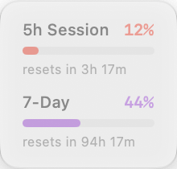
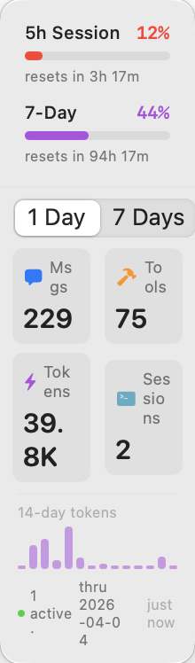

# ClaudeStat

**One floating window. Every Claude client. All your usage at a glance.**

Whether you're chatting on Claude.ai, collaborating in Claude for Work, or running Claude Code in the terminal — your 5-hour session and 7-day usage limits are always visible, always current, floating quietly above whatever you're working on.

**一个悬浮窗，掌握所有 Claude 用量。**

无论你在用网页版 Chat、桌面版 Claude for Work，还是终端里的 Claude Code——5小时会话用量和7日累计用量始终悬浮在屏幕一角，实时可见，从不打扰。

 

---

## Features / 功能

- **Real-time rate limit bars** — 5-hour session usage and 7-day weekly usage, same data source as Claude Code's `/usage` command
- **实时用量进度条** — 5小时会话用量与7日累计用量，数据来源与 Claude Code 的 `/usage` 命令完全一致
- **Color-coded by usage level** — red → purple → blue → green as usage increases
- **四色进度条** — 随用量增加依次显示红、紫、蓝、绿
- **Click to expand** — historical breakdown: messages, tool calls, tokens, sessions (1-day and 7-day)
- **点击展开** — 历史统计：消息数、工具调用数、Token 数、会话数（1日和7日视图）
- **Stays on top** — floats above all windows, drag anywhere, auto-joins all Spaces
- **悬浮置顶** — 悬浮于所有窗口之上，可自由拖动，自动跟随所有桌面空间
- **Semi-transparent** — 50% opacity at rest, full opacity on hover
- **半透明** — 静止时50%透明度，鼠标悬停时恢复不透明

---

## How It Works / 工作原理

ClaudeStat reads two files written by Claude Code:

ClaudeStat 读取 Claude Code 写入的两个文件：

| File | Content | Update frequency |
|------|---------|-----------------|
| `~/.claude/hud-cache.json` | Rate limit percentages, reset times | Every response (real-time) |
| `~/.claude/stats-cache.json` | Daily messages, tokens, sessions | End of each session |

The rate limit data comes from Claude Code's own statusline hook — the same data shown by `/usage`.

用量进度条的数据来自 Claude Code 的 statusline hook，与 `/usage` 命令显示的数据来源完全相同。

---

## Requirements / 系统要求

- macOS 13 (Ventura) or later / macOS 13 或更高版本
- [Claude Code](https://claude.ai/code) installed and configured / 已安装并配置 Claude Code
- Xcode Command Line Tools (`xcode-select --install`)

---

## Installation / 安装

### 1. Clone and build / 克隆并编译

```bash
git clone https://github.com/dmaskhhh/claude-stat.git
cd claude-stat
bash build.sh
```

This creates `~/Applications/ClaudeStat.app`.

以上命令会在 `~/Applications/` 下生成 `ClaudeStat.app`。

### 2. Configure the statusline hook / 配置 statusline hook

Add the following to your `~/.claude/settings.json` to enable real-time data:

在 `~/.claude/settings.json` 中添加以下配置以启用实时数据：

```json
{
  "statusLine": {
    "type": "command",
    "command": "bash -c 'input=$(cat); echo \"$input\" > \"${CLAUDE_CONFIG_DIR:-$HOME/.claude}/hud-cache.json\"'"
  }
}
```

> If you already have a statusLine command configured, append `; echo \"$input\" > ...` to your existing command instead of replacing it.
>
> 如果你已有 statusLine 配置，请在现有命令末尾追加写入逻辑，而不是直接替换。

### 3. Launch / 启动

```bash
open ~/Applications/ClaudeStat.app
```

### 4. Auto-start on login / 开机自启

**System Settings → General → Login Items** → click `+` → select `ClaudeStat.app`

**系统设置 → 通用 → 登录项** → 点击 `+` → 选择 `ClaudeStat.app`

---

## Usage / 使用说明

| Action | Result |
|--------|--------|
| Click the window | Expand / collapse stats detail |
| Drag the window | Reposition anywhere on screen |
| Right-click | Context menu (Refresh / Quit) |
| Hover | Window becomes fully opaque |

---

## Data Sources / 数据说明

- **Rate limit bars (real-time)**: written by Claude Code on every response via the statusline hook
- **进度条（实时）**: 每次 Claude Code 响应后由 statusline hook 写入
- **Expanded stats (session-end)**: `stats-cache.json` is updated when a Claude Code session ends, so the 1-day view shows the most recent completed session's date
- **展开面板（会话结束后更新）**: `stats-cache.json` 在 Claude Code 会话结束时更新，"1 Day" 视图显示最近一次完整会话的数据

---

## License / 许可证

MIT
